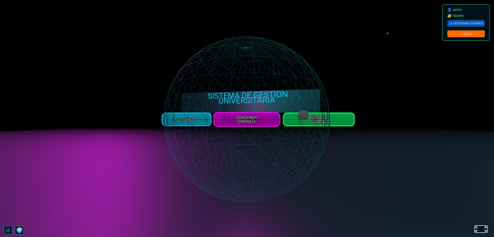
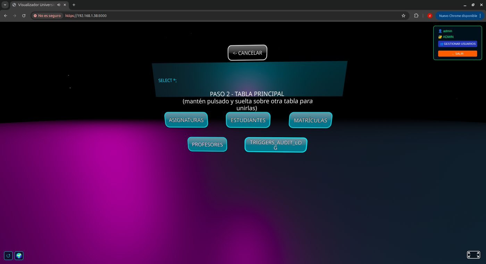
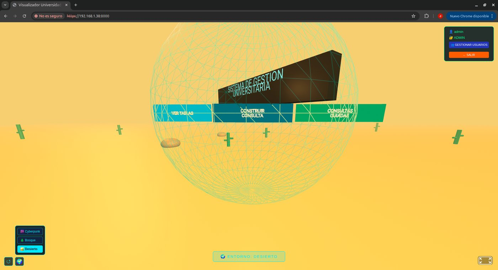

# TFG2-BBDD

Interfaz inmersiva en Realidad Virtual y Realidad Aumentada para la consulta y gestión de bases de datos relacionales. Trabajo de Fin de Grado — Grado en Ingeniería Telemática, Universidad Rey Juan Carlos.

Permite navegar por las tablas de una base de datos PostgreSQL, construir consultas (incluyendo JOIN entre tablas) sin escribir SQL, y visualizar los resultados en tablas o en gráficos 3D, todo ello desde el navegador y funcionando tanto en un ordenador como en gafas de Realidad Virtual/Aumentada.

<p align="center">
  
  
  
</p>

## Características

- **Navegación 3D por las tablas** de la base de datos, con vista en tabla plana o en bloques tridimensionales.
- **Constructor de consultas visual**, incluyendo combinaciones de tablas mediante JOIN, sin necesidad de escribir SQL.
- **Consultas guiadas**: análisis predefinidos ejecutables con un clic.
- **Permisos dinámicos por tabla y por usuario**, aplicados como roles reales de PostgreSQL (no solo a nivel de aplicación).
- **Vistas por rol** (`vista_estudiante` / `vista_profesor`) que ocultan columnas sensibles.
- **Registro de auditoría** de cada inserción, modificación o borrado sobre los datos.
- **Tres entornos visuales** (Cyberpunk, Bosque, Desierto) que retematizan toda la interfaz.
- **Realidad Aumentada** además de Realidad Virtual, gracias a WebXR.

## Tecnologías

| Capa | Tecnología |
|---|---|
| Base de datos | PostgreSQL |
| API REST | PostgREST |
| Backend / autenticación | Flask, bcrypt, JWT |
| Frontend / escena 3D | A-Frame (WebXR) |
| Despliegue | Docker Compose |

## Puesta en marcha

Requisitos: [Docker](https://docs.docker.com/get-started/get-docker/) (con Docker Compose) y [Python 3](https://www.python.org/downloads/).

```bash
git clone https://github.com/rrodriguezh2019/TFG2-BBDD.git
cd TFG2-BBDD
```

Levanta PostgreSQL, PostgREST y pgAdmin. La primera vez, Docker crea también el esquema de la base de datos y carga los datos de ejemplo a partir de `initdb/`:

```bash
docker compose up -d
```

> Si falla con `permission denied` al conectar con Docker, tu usuario no pertenece al grupo `docker`: `sudo usermod -aG docker $USER` y vuelve a iniciar sesión.

Prepara el entorno de Python y arranca el servidor:

```bash
python3 -m venv venv
source venv/bin/activate
pip install -r requirements.txt
python3 https_server.py
```

La aplicación queda disponible en `https://localhost:8000` (certificado autofirmado: el navegador pedirá confirmar la excepción de seguridad la primera vez).

Usuario de prueba ya creado: `admin` / `admin123`, con acceso a las tablas académicas y al registro de auditoría. Desde ahí se pueden crear el resto de usuarios (profesor, estudiante) desde el panel de gestión de usuarios.

## Estructura del repositorio

```
├── https_server.py      # Servidor Flask: autenticación, proxy a PostgREST, endpoints de admin/JOIN
├── index.html            # Frontend completo: escena A-Frame, UI 2D/VR, lógica de cliente
├── docker-compose.yml     # PostgreSQL + PostgREST + pgAdmin
├── initdb/                # Scripts SQL de arranque (esquema, roles, permisos, vistas, triggers)
├── requirements.txt
├── certs/                 # Certificado autofirmado para servir por HTTPS
├── fonts/                  # Fuente TTF usada por el texto 3D (tildes/ñ)
└── docs/                  # Notas técnicas de funcionalidades concretas (ver abajo)
```

## Documentación

- **Memoria completa del TFG**: [rrodriguezh2019/MemoriaTFG-RobertoRodriguez](https://github.com/rrodriguezh2019/MemoriaTFG-RobertoRodriguez)
- **Guía para contribuir / desarrollar**: [CONTRIBUTING.md](CONTRIBUTING.md)
- **Notas técnicas por funcionalidad** (`docs/`):
  - [Permisos dinámicos por tabla](docs/permisos-dinamicos-por-tabla.md)
  - [JOIN en el constructor de consultas](docs/consultas-join-en-constructor-de-consultas.md)
  - [Vistas por rol](docs/vistas-por-rol.md)
  - [Eliminar tablas (DROP TABLE)](docs/eliminar-tablas-drop-table.md)
  - [Proxy Flask → PostgREST (mixed content)](docs/proxy-postgrest-mixed-content.md)
  - [Posicionamiento del teclado virtual](docs/teclado-vr-posicionamiento.md)

## Autoría

**Roberto Rodríguez Hernández** — Trabajo de Fin de Grado tutorizado por David Moreno Lumbreras, Escuela de Ingeniería de Fuenlabrada (URJC).

## Licencia

Distribuido bajo licencia MIT — ver [LICENSE](LICENSE).
